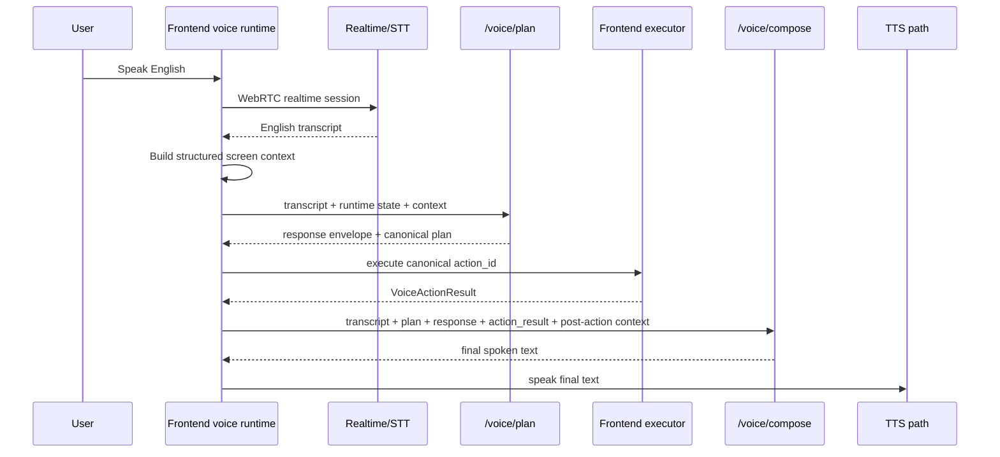

# Kai Voice Runtime Architecture

## Visual Map



Status: canonical current-state reference for the Kai app's in-app voice assistant.

## Purpose

This document describes how the Kai voice runtime works in the checked-in codebase today.

Product truth:

- The checked-in voice runtime is still Kai-first.
- The voice assistant lives inside the Kai app surfaces today.
- One/Nav is approved direction: One becomes the default relationship speaker, Kai remains the finance specialist, and Nav owns privacy/consent/vault/deletion/scope-review language after the migration lands.

Use this file as the maintained architecture reference. The older [kai-voice-assistant-architecture.md](./kai-voice-assistant-architecture.md) remains useful as the original migration/audit document, but it is no longer the best source for current runtime behavior.

## Founder Language Mapping

- `Separation of Duties`: voice planning, execution, and trust checks are split across frontend context building, backend planning/composition, and policy-gated data access
- `Capability Tokens`: voice never bypasses `VAULT_OWNER`, consent, persona, or workspace gates
- `Cryptographic Primitives`: durable voice memory stays vault-gated and encrypted; plaintext browser storage is not a valid fallback
- `TrustLink / A2A delegation`: delegated agent paths must inherit the same consent boundary rather than minting broader voice authority

## One/Nav Migration Boundary

This file documents current state. Do not read the One/Nav ontology as already shipped in the runtime.

The approved migration direction is:

- `One` owns generic speech, shell greetings, memory framing, notifications, and specialist handoffs
- `Kai` owns finance analysis, portfolio, market, RIA finance, and decision-receipt speech
- `Nav` owns consent, scope review, vault, deletion, privacy, and trust-friction speech

Action contracts carry `speaker_persona` so the runtime can move toward that model without changing authority. Speaker persona never bypasses `VAULT_OWNER`, consent, vault, persona, workspace, route, rollout, or kill-switch checks.

## Source Of Truth

Capability authoring is now contract-first.

Use [kai-action-gateway-vnext.md](./kai-action-gateway-vnext.md) as the canonical contributor guide for how actions are authored, generated, and reviewed.

The maintained runtime now depends on these canonical surfaces:

- Local authored action contracts:
  - `hushh-webapp/**/**/*.voice-action-contract.json`
- Generated shared gateway:
  - [contracts/kai/kai-action-gateway.vnext.json](../../../contracts/kai/kai-action-gateway.vnext.json)
- Generated compatibility manifest:
  - [contracts/kai/voice-action-manifest.v1.json](../../../contracts/kai/voice-action-manifest.v1.json)
- Frontend adapters and loaders:
  - [hushh-webapp/lib/voice/kai-action-gateway.ts](../../../hushh-webapp/lib/voice/kai-action-gateway.ts)
  - [hushh-webapp/lib/voice/investor-kai-action-registry.ts](../../../hushh-webapp/lib/voice/investor-kai-action-registry.ts)
  - [hushh-webapp/lib/voice/voice-action-manifest.ts](../../../hushh-webapp/lib/voice/voice-action-manifest.ts)
- Frontend runtime:
  - [hushh-webapp/lib/voice/voice-turn-orchestrator.ts](../../../hushh-webapp/lib/voice/voice-turn-orchestrator.ts)
  - [hushh-webapp/lib/voice/voice-session-manager.ts](../../../hushh-webapp/lib/voice/voice-session-manager.ts)
  - [hushh-webapp/lib/voice/voice-realtime-client.ts](../../../hushh-webapp/lib/voice/voice-realtime-client.ts)
  - [hushh-webapp/lib/voice/voice-grounding.ts](../../../hushh-webapp/lib/voice/voice-grounding.ts)
  - [hushh-webapp/lib/voice/voice-response-executor.ts](../../../hushh-webapp/lib/voice/voice-response-executor.ts)
  - [hushh-webapp/lib/voice/voice-action-dispatcher.ts](../../../hushh-webapp/lib/voice/voice-action-dispatcher.ts)
  - [hushh-webapp/lib/voice/voice-action-settlement.ts](../../../hushh-webapp/lib/voice/voice-action-settlement.ts)
  - [hushh-webapp/lib/voice/voice-response-composer.ts](../../../hushh-webapp/lib/voice/voice-response-composer.ts)
  - [hushh-webapp/lib/voice/voice-tts-playback.ts](../../../hushh-webapp/lib/voice/voice-tts-playback.ts)
  - [hushh-webapp/lib/voice/voice-memory-store.ts](../../../hushh-webapp/lib/voice/voice-memory-store.ts)
  - [hushh-webapp/lib/kai/command-executor.ts](../../../hushh-webapp/lib/kai/command-executor.ts)
- Frontend context and UI entrypoints:
  - [hushh-webapp/lib/voice/screen-context-builder.ts](../../../hushh-webapp/lib/voice/screen-context-builder.ts)
  - [hushh-webapp/lib/voice/voice-surface-metadata.ts](../../../hushh-webapp/lib/voice/voice-surface-metadata.ts)
  - [hushh-webapp/components/kai/kai-command-bar-global.tsx](../../../hushh-webapp/components/kai/kai-command-bar-global.tsx)
  - [hushh-webapp/components/kai/kai-search-bar.tsx](../../../hushh-webapp/components/kai/kai-search-bar.tsx)
- Backend runtime:
  - [consent-protocol/api/routes/kai/voice.py](../../../consent-protocol/api/routes/kai/voice.py)
  - [consent-protocol/hushh_mcp/services/voice_intent_service.py](../../../consent-protocol/hushh_mcp/services/voice_intent_service.py)
  - [consent-protocol/hushh_mcp/services/voice_prompt_builder.py](../../../consent-protocol/hushh_mcp/services/voice_prompt_builder.py)
  - [consent-protocol/hushh_mcp/services/voice_action_manifest.py](../../../consent-protocol/hushh_mcp/services/voice_action_manifest.py)
  - [consent-protocol/hushh_mcp/services/voice_app_knowledge.py](../../../consent-protocol/hushh_mcp/services/voice_app_knowledge.py)

## Runtime Flow

The current runtime is a closed-loop hybrid flow:

1. Speech enters the frontend voice runtime.
2. OpenAI Realtime transcription produces the final transcript. Batch audio upload routes are intentionally removed; voice input is realtime-only.
3. The frontend builds live route, screen, runtime, auth, vault, and surface metadata context.
4. The frontend calls `/voice/plan`.
5. The backend planner returns both:
   - a legacy-compatible response envelope
   - canonical planner fields such as `mode`, `action_id`, `slots`, `guards`, and `reply_strategy`
6. The frontend grounds and executes the canonical plan.
7. The executor emits a typed `VoiceActionResult`.
8. The frontend rebuilds post-action screen context.
9. When the plan requests LLM-backed final speech, the frontend calls `/voice/compose`.
10. The composed or fallback English text is spoken through the active TTS path.

The canonical plan modes are:

- `answer_now`
- `execute_and_wait`
- `start_background_and_ack`
- `clarify`

## Language Policy

Kai voice is English-only in the current runtime.

- Realtime transcription pins OpenAI transcription to language `en` and uses an English-only transcription prompt.
- Non-English or unusable transcripts fail closed into a clarification response; the response remains English and keeps the compatibility reason `stt_unusable`.
- Planner and composer prompts include an explicit language policy: accept English-language transcripts only, and produce English-only tool arguments, clarification text, and spoken replies.
- TTS receives only composed English text plus an OpenAI speech instruction to speak English only; the legacy browser speech fallback is also pinned to `en-US`.
- The voice runtime does not call OpenAI translation endpoints and does not translate user speech into another language.

## Backend Architecture

### Prompt and identity layers

The backend uses layered prompt/context construction instead of one inline prompt string.

- [voice_prompt_builder.py](../../../consent-protocol/hushh_mcp/services/voice_prompt_builder.py) builds shared planner/composer context
- [voice_app_knowledge.py](../../../consent-protocol/hushh_mcp/services/voice_app_knowledge.py) provides Kai identity, PKM/Gmail/receipt concepts, and global knowledge summaries
- [voice_action_manifest.py](../../../consent-protocol/hushh_mcp/services/voice_action_manifest.py) loads the shared semantic action data used by prompt selection

Planner context currently includes:

- Kai role summary and guardrails
- relevant manifest actions for the current screen and transcript
- runtime state
- global concept summaries

Composer context reuses the same layers and adds:

- transcript
- canonical plan payload
- response payload
- observed `action_result`

### Planning and response normalization

[voice_intent_service.py](../../../consent-protocol/hushh_mcp/services/voice_intent_service.py) owns:

- realtime/STT/TTS upstream calls
- deterministic fast paths
- LLM planning
- tool-call validation
- canonical-plan normalization
- post-execution response composition

Important current behavior:

- deterministic fast paths still exist for low-latency explain/status/navigation turns
- the LLM still plans through a tool-call schema, then canonical fields are normalized afterward
- canonical plan data is first-class in the current route contract
- legacy response fields are still dual-written for compatibility

### Routes

[voice.py](../../../consent-protocol/api/routes/kai/voice.py) exposes multiple voice surfaces. The main runtime routes are:

- `/voice/plan`
- `/voice/compose`
- `/voice/tts`
- `/voice/realtime/session`
- `/voice/capability` (`POST`)

`/voice/plan` is the main planning transport and still preserves rollout, canary, and kill-switch behavior.

`/voice/compose` is the post-execution response-composition transport. It receives:

- transcript
- response envelope
- canonical plan fields
- `action_result`
- runtime state
- structured screen context after execution

and calls `compose_voice_reply(...)` in [voice_intent_service.py](../../../consent-protocol/hushh_mcp/services/voice_intent_service.py).

### Route gates and rollout semantics

All backend voice routes require a `VAULT_OWNER` bearer token, and the request `user_id` must match the token user.

Voice rollout is controlled by `VOICE_RUNTIME_CONFIG_JSON`:

- global hosted voice enablement
- optional user allowlist
- stable canary bucket percentage
- realtime enablement
- tool-execution kill switch
- model and timeout defaults

`/voice/capability` reports both rollout and realtime availability. `voice_enabled` means the user is inside voice rollout. `enabled` means the realtime voice path is available for that user/runtime. When rollout is disabled, `/voice/plan` returns HTTP 200 with a non-executable `speak_only` response, while realtime session creation and TTS return HTTP 403.

### Speech, realtime, and TTS boundaries

`/voice/realtime/session` creates the OpenAI realtime client secret and configures:

- server VAD
- near-field noise reduction
- input transcription model
- `transcription_language: "en"`
- English-only transcription prompt

The frontend preserves those transcription settings when it sends its post-handshake `session.update` for VAD and output voice. Realtime model auto-response is disabled on the normal path; the app requests speech explicitly with English-only output instructions after planning/execution/composition.

Normal frontend post-dispatch speech prefers realtime-stream TTS through the active realtime client. `/voice/tts` remains the backend streaming speech endpoint for explicit backend synthesized playback, with binary audio headers and English-only speech instructions. The frontend backend-batch fallback path is currently disabled by feature flag. The backend runtime accepts a `tts_models` list in config, then chooses one prioritized active TTS model at service initialization. The legacy browser speech synthesis fallback is pinned to `en-US`.

## Frontend Architecture

### Context building

The frontend creates the structured voice context from:

- route state
- current screen identity
- surface metadata
- visible controls/actions
- auth/vault/runtime state
- short-term and retrieved memory when available

Key files:

- [screen-context-builder.ts](../../../hushh-webapp/lib/voice/screen-context-builder.ts)
- [voice-surface-metadata.ts](../../../hushh-webapp/lib/voice/voice-surface-metadata.ts)
- [kai-command-bar-global.tsx](../../../hushh-webapp/components/kai/kai-command-bar-global.tsx)
- [kai-search-bar.tsx](../../../hushh-webapp/components/kai/kai-search-bar.tsx)

### Grounding and execution

The normal execution path is canonical-plan first:

- [voice-grounding.ts](../../../hushh-webapp/lib/voice/voice-grounding.ts) prefers planner-provided `action_id`
- transcript heuristics remain only as compatibility fallback
- [voice-response-executor.ts](../../../hushh-webapp/lib/voice/voice-response-executor.ts) and [voice-action-dispatcher.ts](../../../hushh-webapp/lib/voice/voice-action-dispatcher.ts) execute the grounded action
- [command-executor.ts](../../../hushh-webapp/lib/kai/command-executor.ts) returns typed execution outcomes

### Settlement and final speech

[voice-action-settlement.ts](../../../hushh-webapp/lib/voice/voice-action-settlement.ts) waits for:

- route change
- expected screen identity
- meaningful surface metadata

before a navigation turn is treated as settled.

[voice-turn-orchestrator.ts](../../../hushh-webapp/lib/voice/voice-turn-orchestrator.ts) then:

1. dispatches the action
2. captures `VoiceActionResult`
3. rebuilds post-action context
4. calls `/voice/compose` when `reply_strategy === "llm"`
5. falls back to [voice-response-composer.ts](../../../hushh-webapp/lib/voice/voice-response-composer.ts) only when needed

The important correction from the older architecture is that the normal path is now `plan -> execute -> observe -> compose -> speak`.

## Shared Manifest And Contracts

### Generated action gateway

The shared semantic authority is now [contracts/kai/kai-action-gateway.vnext.json](../../../contracts/kai/kai-action-gateway.vnext.json).

The gateway is generated from colocated local action contracts by [generate-kai-action-gateway.mjs](../../../hushh-webapp/scripts/voice/generate-kai-action-gateway.mjs).

Runtime consumption:

- backend loader: [voice_action_manifest.py](../../../consent-protocol/hushh_mcp/services/voice_action_manifest.py)
- frontend gateway utilities: [kai-action-gateway.ts](../../../hushh-webapp/lib/voice/kai-action-gateway.ts)
- frontend registry adapter: [investor-kai-action-registry.ts](../../../hushh-webapp/lib/voice/investor-kai-action-registry.ts)

The older [voice-action-manifest.v1.json](../../../contracts/kai/voice-action-manifest.v1.json) still exists, but it is now a generated compatibility artifact rather than the primary authored source.

Generated actions include `speaker_persona` and may include `delegate_agent_id`:

- `one`: general, route, shell, memory, and handoff framing
- `kai`: finance and analysis actions
- `nav`: privacy, consent, vault, deletion, revocation, and scope-review actions
- `kyc`: explicit identity/KYC workflow status, missing-document review, approval-gated draft, and structured writeback actions

Navigation action ids use `route.*`. The `nav.*` namespace is reserved for true Nav guardian actions and must not be used for ordinary route changes.

If the generated manifest is missing, the backend manifest loader degrades to an empty `source: "missing"` manifest instead of failing import. That is a degraded prompt-selection state, not a valid release state; `verify:voice-gateway` and docs/runtime verification should catch it. When a manifest is present but no action ranks for the current screen/transcript, prompt selection falls back to the first generated actions.

### Capability authoring boundary

Capability existence and shared semantics come from local contracts plus the generated gateway.

Runtime surface metadata remains responsible for:

- current state
- active control
- selected entity
- visible modules
- busy operations
- explainable screen context

Do not use runtime surface metadata as the source of capability existence.

### Canonical plan fields

The current frontend/backend contract recognizes:

- `schema_version`
- `mode`
- `action_id`
- `slots`
- `guards`
- `reply_strategy`
- `clarification`
- `action_completion`

Types live in [voice-types.ts](../../../hushh-webapp/lib/voice/voice-types.ts). Validation lives in [voice-json-validator.ts](../../../hushh-webapp/lib/voice/voice-json-validator.ts).

### VoiceActionResult

The current typed observed result includes:

- `status`
- `action_id`
- `route_before`
- `route_after`
- `screen_before`
- `screen_after`
- `settled_by`
- `result_summary`
- optional structured `data`

This is the contract shared by the backend composer path and the deterministic fallback composer.

### Authored workflows and persona gating

The gateway now supports authored multi-step workflows.

Current examples include:

- persona switch plus route switch for RIA entry
- route prerequisite plus tool call for hidden-but-navigable actions

Rules:

- voice may auto-chain only authored prerequisite steps
- settlement is required between steps
- persona and workspace are hard preconditions
- unavailable workspaces block or require explicit switch instead of pretending the action is flat-global

### RIA workspace support

RIA support in the current voice runtime covers the workspace entry, onboarding, client roster, client workspace tabs, account/request detail fallbacks, stock picks, compatibility routes, and marketplace RIA profile surfaces.

The frontend can ground a canonical `route.ria_home` planner action into this authored workflow:

1. ask for confirmation before switching to the `ria` persona
2. dispatch `switch_persona` only after confirmation
3. wait for persona settlement when metadata is available
4. route to `/ria`
5. wait for `/ria` / `ria_home` settlement when metadata is available

If the account has not unlocked RIA, grounding returns an unavailable plan with setup guidance. If the user is already in the RIA persona and already on `/ria`, the executor returns a no-op instead of creating a fake mutation.

Other RIA actions follow these rules:

- safe route navigation can execute directly, for example `route.ria_clients`, `route.ria_picks`, and `route.ria_onboarding`
- RIA picks source/category switches are route-state actions such as `/ria/picks?source=kai` and `/ria/picks?category=top-picks`
- client workspace tab actions use dynamic routes like `/ria/clients/[userId]?tab=access`; grounding replaces `[userId]` from the current RIA client route and fails closed when the selected client is missing
- client/account/request row actions that require a specific clicked id stay manual-only unless that id is already safely present in the current route
- consent-request, disconnect, marketplace advisory, onboarding verification, and advisor-package save actions are manual-only or confirmation-required and currently unwired
- Kai must not claim it completed manual-only RIA mutations

## Voice Navigation And Analysis Surfaces

The primary navigation and analysis actions are authored in local contracts and consumed through:

- [kai-action-gateway.ts](../../../hushh-webapp/lib/voice/kai-action-gateway.ts)
- [investor-kai-action-registry.ts](../../../hushh-webapp/lib/voice/investor-kai-action-registry.ts)
- [contracts/kai/kai-action-gateway.vnext.json](../../../contracts/kai/kai-action-gateway.vnext.json)

Important current voice surfaces include:

- Kai home / market
- portfolio dashboard
- analysis workspace
- analysis history
- import
- profile
- Gmail receipts
- PKM / PKM Agent Lab
- consent center
- RIA workspace entry, onboarding, clients, picks, client workspace, and marketplace RIA profile

Important analysis actions include:

- `analysis.start`
- `analysis.resume_active`
- `analysis.cancel_active`

The same action plane now also powers typed search suggestions and control-id mapping in the Kai search bar.

## Memory And Privacy

Voice memory now follows the vault-safe BYOK/ZK boundary:

- short-term memory remains in-memory only
- durable voice memory is available only when the vault is unlocked
- durable voice memory is stored in encrypted IndexedDB
- plaintext browser fallback is not allowed

The current implementation is in [voice-memory-store.ts](../../../hushh-webapp/lib/voice/voice-memory-store.ts).

## Observability And Debugging

Current voice debugging spans both frontend and backend.

Backend:

- `/voice/realtime/session` session creation and transcription metadata
- `/voice/plan` tracing and latency metrics
- `/voice/compose` tracing and latency metrics
- `/voice/tts` streaming lifecycle and client-disconnect handling
- rollout/canary/kill-switch decisions in the route layer

Frontend:

- `stt`
- `planner`
- `dispatch`
- `tts`
- `ui_fsm`

These stage names line up with the current voice debug overlay and recent-event payloads.

## Remaining Compatibility Shims

The current runtime is implemented, but a few compatibility shims remain intentional:

- backend still dual-writes legacy response fields such as `kind`, `message`, and `tool_call`
- rollout/kill-switch logic can still downgrade execution-capable turns to `speak_only`
- `resolveGroundedVoicePlan(... allowCompatibilityFallback)` still exists for planner payloads that omit `action_id`
- `executeVoiceResponse(... allowSpeakOnlyCompatibilityFallback)` still exists as an opt-in escape hatch, default off
- deterministic fast paths still coexist with the LLM planner for latency-sensitive turns

These are compatibility measures, not the main architecture.

## Known Drift To Watch

The main documentation/code drift found during this refresh:

- the older migration/audit doc still described several pre-implementation problems as if they were current state
- screen identifiers still drift across route derivation, command execution, surface publishers, and manifest expectations, which can cause settlement to fall back to timeout on otherwise successful navigations
- not every Kai surface is yet covered by a colocated local action contract, so discoverability coverage is still incomplete outside the current seeded surfaces
- the current screen/button/action coverage audit lives in [kai-voice-action-coverage-audit.md](./kai-voice-action-coverage-audit.md)

## Maintainer Checklist

When changing Kai voice behavior:

1. update the local `.voice-action-contract.json` first
2. regenerate the action gateway and compatibility manifest
3. keep backend route contracts, frontend types, and validators aligned with the generated gateway
4. update [kai-action-gateway-vnext.md](./kai-action-gateway-vnext.md) when the authoring contract or governance rules change
5. update this document when the runtime flow, settlement model, or backend/frontend ownership changes
6. update the historical audit doc only when its migration notes need correction, not as the main runtime source

## Verification

Minimum verification for docs-only changes:

```bash
./bin/hushh docs verify
python3 .codex/skills/docs-governance/scripts/doc_inventory.py tier-a
```

If the shared manifest or voice registry changes, also run:

```bash
cd hushh-webapp && npm run build:voice-gateway
cd hushh-webapp && npm run verify:voice-gateway
cd hushh-webapp && npm test -- __tests__/voice/kai-action-gateway.test.ts __tests__/voice/voice-action-manifest.test.ts __tests__/voice/investor-kai-action-registry.test.ts __tests__/voice/voice-grounding.test.ts __tests__/voice/voice-turn-orchestrator.test.ts
```

If backend voice routes or planner/composer contracts change, also run the focused backend voice suites.

## Related References

- [kai-action-gateway-vnext.md](./kai-action-gateway-vnext.md)
- [kai-voice-action-coverage-audit.md](./kai-voice-action-coverage-audit.md)
- [kai-voice-assistant-architecture.md](./kai-voice-assistant-architecture.md)
- [kai-route-audit-matrix.md](./kai-route-audit-matrix.md)
- [kai-runtime-smoke-checklist.md](./kai-runtime-smoke-checklist.md)
- [env-and-secrets.md](../operations/env-and-secrets.md)
